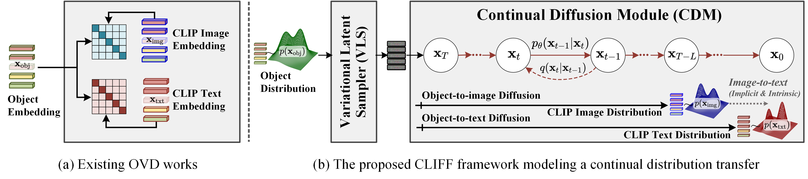

# [ECCV' 24 Oral] CLIFF: Continual Latent Diffusion for Open-Vocabulary Object Detection

### [[Paper]](https://www.ecva.net/papers/eccv_2024/papers_ECCV/html/7221_ECCV_2024_paper.php) [[Poster]](./assets/poster.png) [[Video Presentation]](https://www.youtube.com/watch?v=jvb9VP-l2rY)  

📌 This is an official PyTorch implementation of CLIFF: Continual Latent Diffusion for Open-Vocabulary Object Detection

> [**CLIFF: Continual Latent Diffusion for Open-Vocabulary Object Detection**](https://www.ecva.net/papers/eccv_2024/papers_ECCV/html/7221_ECCV_2024_paper.php)<br>
> [Wuyang Li<sup>1</sup>](https://wymancv.github.io/wuyang.github.io/), [Xinyu Liu<sup>1</sup>](https://xinyuliu-jeffrey.github.io/), [Jiayi Ma<sup>2</sup>](https://scholar.google.com/citations?user=73trMQkAAAAJ&hl=en), [Yixuan Yuan<sup>1</sup>](http://www.ee.cuhk.edu.hk/~yxyuan/)<br><sup>1</sup> The Chinese Univerisity of Hong Kong; <sup>2</sup> Wuhan University

<div align="center">
    
</div>

Contact: [wymanbest@outlook.com](mailto:wymanbest@outlook.com)

## 📢 News

- [09-26-2024] Code is released
- [08-12-2024] CLIFF is selected as an oral presentation
- [07-14-2024] CLIFF is accepted at ECCV 2024

## ✨ Highlight

CLIFF is a probabilistic pipeline modeling the distribution transition among the object, CLIP image, and text subspaces with continual diffusion. Our contributions can be divided into the following aspects:

- Leveraging the diffusion process to model the distribution transfer from the object to the CLIP image and text continually.
- A simple and lightweight latent diffuser with an MLP architecture deployed in the object and CLIP embedding space.
- Efficient diffusion process with only 10 time-steps without obvious runtime sacrifice.
- As a byproduct, CLIFF connects VAE and diffusion models by sampling the object-centric noise

## 🛠️ Installation

```bash
# clone the repo
git clone https://github.com/CUHK-AIM-Group/CLIFF.git

# conda envs
conda create -n cliff python=3.9 -y
conda activate cliff

# [Optionally] check your cuda version and modify accordingly
export CUDA_HOME=/usr/local/cuda-11.3
export PATH=$CUDA_HOME/bin:$PATH
export LD_LIBRARY_PATH=$CUDA_HOME/lib64:$LD_LIBRARY_PATH

pip install torch==1.10.0+cu113 torchvision==0.11.0+cu113 -f https://download.pytorch.org/whl/cu113/torch_stable.html

# install pre-built detectron2
python -m pip install detectron2 -f \
  https://dl.fbaipublicfiles.com/detectron2/wheels/cu113/torch1.10/index.html

# install dependence
pip install -r requirements.txt
```

## 📂 Dataset Preparation
Please follow the steps in [DATASETS.md](assets/DATASETS.md) to prepare the dataset. 

Then, change the dataset root `_root=$Your dataset root` in `ovd/datasets/coco_zeroshot.py`, and change the path in all yaml files `configs/xxx.yaml` accordingly.


## 🚀 Minimum Viable Product Version: Classification with CLIFF

We release a MVP version of CLIFF for Cifar-10 classification in the folder [cifar10](./cifar10/), which is much more user-friendly and cute. The general idea is to generate CLIP text embedding with the same diffusor used in CLIFF, and measure the Euclidean distance between the generated embedding with CLIP embedding to make the class decision. You can directly transfer this simple verison to your project. The code refernce is https://github.com/kuangliu/pytorch-cifar.

| Feature Extractor| Baseline | Ours |
|----------|----------|----------|
| ResNet-18|  [93.02%](https://github.com/kuangliu/pytorch-cifar) |   95.00% |

To train and evaluate the MVP code, you can follow the following steps.

```bash
cd cifar10

python train_net_diffusion.py \
    --lr 0.1 \
    --dir ./experiments
```

## 📊 Evaluation: Detection with CLIFF

It's worth noting that there may be around a 1.0 $\text{mAP}_n$ (IoU@50) difference in each evluation using different random seeds. This is because, in revserse diffusion, the noise is random sampled and slightly affects class decision-making. This phenomenon is similar in generative tasks, where using different seeds results in different outputs. The model link for OVD COCO can be fould below,

<table>
  <tr>
    <th>SEED </th>
    <th>mAP<sub>n</sub></th>
    <th>mAP<sub>b</sub></th>
    <th>mAP</th>
    <th>Link</th>
  </tr>
  <tr>
    <td>9</td>
    <td>43.07</td>
    <td>54.53</td>
    <td>51.54</td>
    <td rowspan="3"><a href="https://1drv.ms/u/s!AphTD4EdTQo1hPZMDDcyvOwvhJWkrQ?e=CBpvqE">Onedrive</a></td>
  </tr>
  <tr>
    <td>99</td>
    <td>43.36</td>
    <td>54.39</td>
    <td>51.51</td>
  </tr>
  <tr>
    <td>999</td>
    <td>43.44</td>
    <td>54.44</td>
    <td>51.51</td>
  </tr>
</table>

To evaluate the model with 4 GPUs, use the following commands. You can change `CUDA_VISIBLE_DEVICES` and `num-gpus` to use a different number of GPUs:

```python
CUDA_VISIBLE_DEVICES=1,2,3,4 python train_net_diffusion.py \
    --num-gpus 4 \
    --config-file /path/to/config/name.yaml \
    --eval-only \
    MODEL.WEIGHTS /path/to/weight.pth \
    SEED 999
```
For example:

```python
CUDA_VISIBLE_DEVICES=1,2 python train_net_diffusion.py \
    --num-gpus 2 \
    --config-file configs/CLIFF_COCO_RCNN-C4_obj2img2txt_stage2.yaml \
    --eval-only \
    MODEL.WEIGHTS ./cliff_model_coco_ovd.pth \
    SEED 999
```

## 🏋️ Train: Detection with CLIFF

Since I recently changed my working position, I no longer have access to the original GPU resources. We are currently double-checking the training process on other machines after cleaning up the code. We will release the training code as soon as possible. Nonetheless, we have provided the unverified script for the `train.sh`.


## 🙏 Acknowledgement

Greatly appreciate the tremendous effort for the following projects!
- [Our OVD baseline model](https://github.com/hanoonaR/object-centric-ovd)
- [A simple DDPM implementation](https://github.com/zoubohao/DenoisingDiffusionProbabilityModel-ddpm-)
- [A simple cifar-10 benchmark](https://github.com/kuangliu/pytorch-cifar)


## 📋 TODO List
- [X] Release code for CLIFF
- [X] Release the MVP version for CLIFF
- [ ] Release the verified training scripts
- [ ] Release the code and model for LVIS setting


##  📚Citeation

If you think our work is helpful for your project, I would greatly apprecitate it if you can consdier citing our work

```bibtex
@inproceedings{Li2024cliff,
    title={CLIFF: Continual Latent Diffusion for Open-Vocabulary Object Detection},
    author={Wuyang Li, Xinyu Liu, Jiayi Ma, Yixuan Yuan},
    booktitle={ECCV},
    year={2024}
}
```
<!-- <br>Contact: [Wuyang Li](https://wymancv.github.io/wuyang.github.io/) -->


